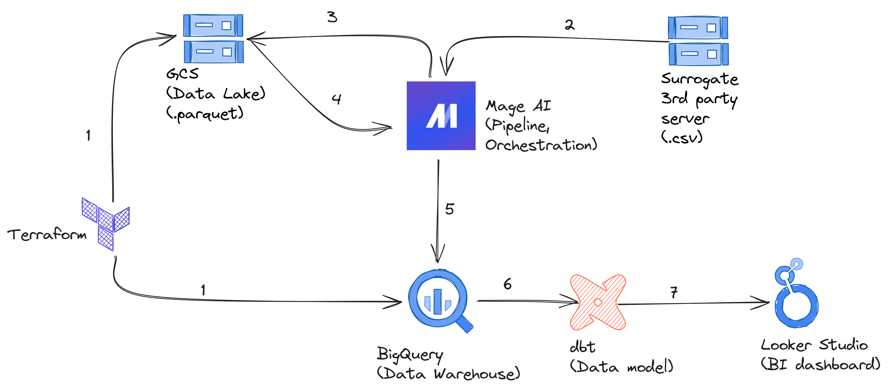

This is my final project for Data Engineering Zoomcamp.

- Name: Pham Nguyen Hung
- Signed-up email: hungpn032003@gmail.com

<!-- START doctoc -->
<!-- END doctoc -->

# Disclaimer

I started the course late and did not finish Week 5 and Week 6 before doing the project. I also went into a sprint at work so I decided to complete a minimal project first before revisit the materials when I have a respite. Being minimal, this project will pass each quantitative category while being very non-extra-ordinary.

# Problem statement

I used the Kaggle dataset [New York Times Best Sellers](https://www.kaggle.com/datasets/dhruvildave/new-york-times-best-sellers), which containers all weekly New York Times Best Sellers List for the decade fo 2010-2019. The general question was "What is the profile of the top 100 New York Times Best Sellers of the decade?" Top 100 was selected based on *number of weekly appearances on the list* (more is better) and *average weekly ranking* (smaller is better). From this, I created a dashboard with 2 tiles to describe

1. The number of titles in each category appeared on the list.
2. The number of weekly appearances for top authors.

# Architecture

The project made use of technologies introduced in the first 4 weeks of the course: Terraform, Docker, Mage AI, Google Cloud Storage (GCS), BigQuery, dbt, and Looker Studio.

- The cloud resources were generated with Terraform.
- Downloading the data from Kaggle was a bit complicated with Mage AI. I decided to download the file and upload it to a GCS bucket as a surrogate 3rd parth server instead.
- Mage AI was used to create and orchestrate 2 ETL pipelines to ingest the data to the data lake and then the data warehouse.
- dbt was used to create the data transformation model from the base table in the data warehouse used to create the visualizations for the dashboard.
- Looker Studio was used to create dashboard from the data in BigQuery.

# How to run

The code for each part are included in the relevant folder of the repo. The specific changes will be presented sequentially below. Starting from `root`:

- `dbt`: contains file for my dbt model.
- `pipeline`: contains file for Mage pipelines.
- `terraform`: contains file for Terraform resource creation.
- `bestsellers.csv`: the original file from Kaggle.
  
## Step 1. Resource creation (`terraform` folder)

The requirements here are one or more GCS buckets and a BigQuery schema, which is quite similar to what is introduced in the second part of lecture 1. In fact, the files in this folder are adapted from the `terraform_with_variables` folder used in that part.