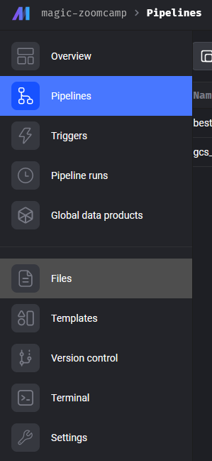
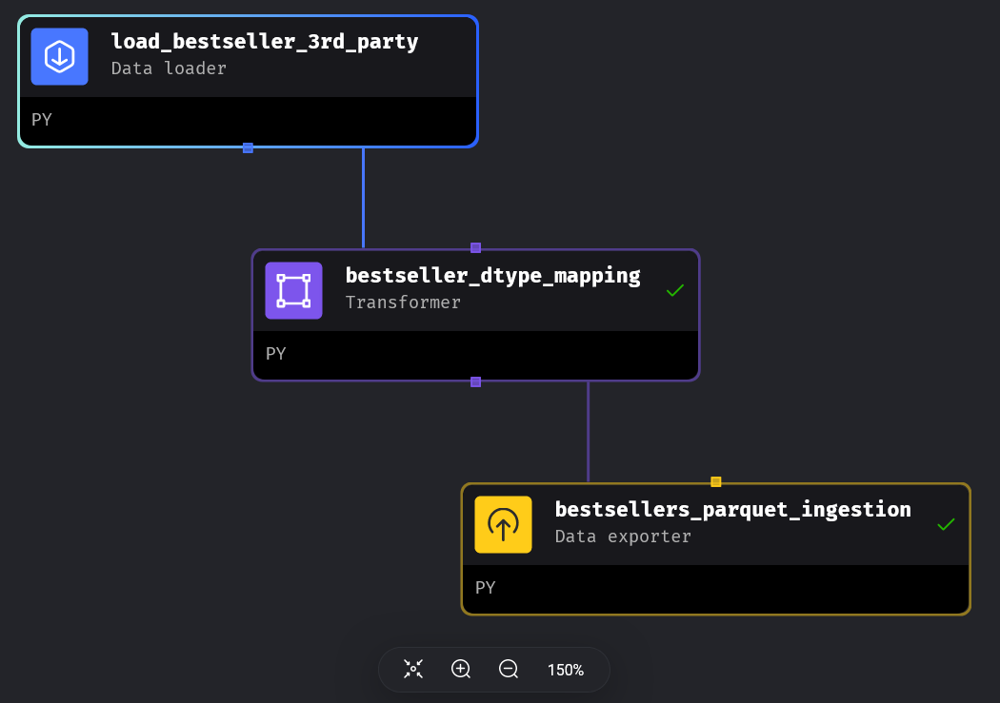
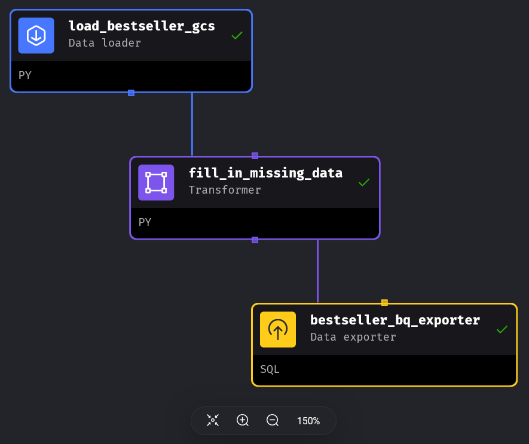
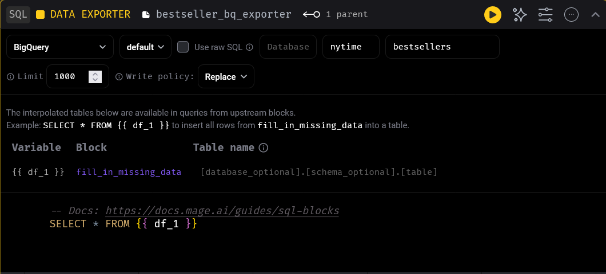

This is my final project for Data Engineering Zoomcamp.

- Name: Pham Nguyen Hung
- Signed-up email: hungpn032003@gmail.com

<!-- START doctoc generated TOC please keep comment here to allow auto update -->
<!-- DON'T EDIT THIS SECTION, INSTEAD RE-RUN doctoc TO UPDATE -->
**Table of Contents**

- [Disclaimer](#disclaimer)
- [Problem statement](#problem-statement)
- [Architecture](#architecture)
- [How to run](#how-to-run)
  - [Step 1. Resource creation (`terraform` folder)](#step-1-resource-creation-terraform-folder)
  - [Step 2 - 5. Pipeline creation (`pipeline` folder)](#step-2---5-pipeline-creation-pipeline-folder)
    - [Change config file](#change-config-file)
    - [Pipeline 1: Load data from (surrogate) 3rd party server and load into data lake (GCS bucket)](#pipeline-1-load-data-from-surrogate-3rd-party-server-and-load-into-data-lake-gcs-bucket)
    - [Pipeline 2: Load data from data lake into data warehouse (BigQuery)](#pipeline-2-load-data-from-data-lake-into-data-warehouse-bigquery)

<!-- END doctoc generated TOC please keep comment here to allow auto update -->

# Disclaimer

I started the course late and did not finish Week 5 and Week 6 before doing the project. I also went into a sprint at work so I decided to complete a minimal project first before revisit the materials when I have a respite. Being minimal, this project will pass each quantitative category while being very non-extra-ordinary.

# Problem statement

I used the Kaggle dataset [New York Times Best Sellers](https://www.kaggle.com/datasets/dhruvildave/new-york-times-best-sellers), which containers all weekly New York Times Best Sellers List for the decade fo 2010-2019. The general question was "What is the profile of the top 100 New York Times Best Sellers of the decade?" Top 100 was selected based on *number of weekly appearances on the list* (more is better) and *average weekly ranking* (smaller is better). From this, I created a dashboard with 2 tiles to describe

1. The number of titles in each category appeared on the list.
2. The number of weekly appearances for top authors.

# Architecture


The project made use of technologies introduced in the first 4 weeks of the course: Terraform, Docker, Mage AI, Google Cloud Storage (GCS), BigQuery, dbt, and Looker Studio.

- The cloud resources were generated with Terraform.
- Downloading the data from Kaggle was a bit complicated with Mage AI. I decided to download the file and upload it to a GCS bucket as a surrogate 3rd parth server instead.
- Mage AI was used to create and orchestrate 2 ETL pipelines to ingest the data to the data lake and then the data warehouse.
- dbt was used to create the data transformation model from the base table in the data warehouse used to create the visualizations for the dashboard.
- Looker Studio was used to create dashboard from the data in BigQuery.

# How to run

The code for each part are included in the relevant folder of the repo. The specific changes will be presented sequentially below. Starting from `root`:

- `dbt`: contains file for my dbt model.
- `pipeline`: contains file for Mage pipelines.
- `terraform`: contains file for Terraform resource creation.
- `bestsellers.csv`: the original file from Kaggle.
  
## Step 1. Resource creation (`terraform` folder)

The requirements here are one or more GCS buckets and a BigQuery schema, which is quite similar to what is introduced in the second part of lecture 1. In fact, the files in this folder are adapted from the `terraform_with_variables` folder used in that part. Here you need to adapt the fields in `variables.tf` to your project. Specifically for credential, the service account must have at least the relevant GCS and BigQuery permissions. The easiest way is just selecting "GCS Admin" and "BigQuery Admin", but can be more fine-grained. Afterwards, just run
```sh
# Initialize Terraform
terraform init

# To view what you are going to create (optional due to simplicity of this project)
terraform plan

# To apply the changes
terraform apply
```

## Step 2 - 5. Pipeline creation (`pipeline` folder)

The environment is containerized with Docker. Before running `docker-compose up`, there are prerequisite:
- Change `dev.env` to `.env`.
- Add GCP's service account key to the folder. The folder is used as the volume to the container, so the service account key has to be there to be found.
- Download the dataset above from Kaggle and upload it to a GCS bucket. For simplicity, I used the same bucket as the one storing the parquet file later.

Afterwards, run `docker-compose up` to start developing. There will be 2 pipelines to create

### Change config file

The first step is navigating to Files to change `io_config.yaml` so that we can access GCP.


Navigate to the Google section and modify ito
```yaml
version: 0.1.1
default:
  ...
    # Google
  GOOGLE_SERVICE_ACC_KEY_FILEPATH: "credential.json"
  GOOGLE_LOCATION: US # Optional
```
You want to relative location of the credential .json file. To find it, you go to the Terminal tab of your Mage code editor and type `ls -la`. Copy or type the printed out .json file name.

### Pipeline 1: Load data from (surrogate) 3rd party server and load into data lake (GCS bucket)

The DAG is simple with 3 nodes: 1 Data Loader, 1 Transformer, 1 Data Exporter.


The full code for each
- `load_bestseller_3rd_party`:
```py
from mage_ai.settings.repo import get_repo_path
from mage_ai.io.config import ConfigFileLoader
from mage_ai.io.google_cloud_storage import GoogleCloudStorage
from os import path
if 'data_loader' not in globals():
    from mage_ai.data_preparation.decorators import data_loader
if 'test' not in globals():
    from mage_ai.data_preparation.decorators import test


@data_loader
def load_from_google_cloud_storage(*args, **kwargs):
    config_path = path.join(get_repo_path(), 'io_config.yaml')
    config_profile = 'default'

    bucket_name = 'dezoomcamp-416702-terra-bucket'
    object_key = 'bestsellers.csv'

    return GoogleCloudStorage.with_config(ConfigFileLoader(config_path, config_profile)).load(
        bucket_name,
        object_key,
    )


@test
def test_output(output, *args) -> None:
    """
    Template code for testing the output of the block.
    """
    print(output.dtypes)
    assert output is not None, 'The output is undefined'
```
- `bestseller_dtype_mapping`:
```py
import pandas as pd

if 'transformer' not in globals():
    from mage_ai.data_preparation.decorators import transformer
if 'test' not in globals():
    from mage_ai.data_preparation.decorators import test


@transformer
def transform(data, *args, **kwargs):
    # Specify your transformation logic here
    bestsellers_dtypes = {
        "list_name": pd.CategoricalDtype(),
        "list_name_encoded": pd.CategoricalDtype(),
        "isbn13": "string",
        "isbn10": "string",
        "title": "string",
        "author": "string",
        "description": "string",
        "amazon_product_url": "string"}
    data['published_date'] = pd.to_datetime(data['published_date'])
    return data.astype(bestsellers_dtypes)

@test
def test_output(output, *args) -> None:
    """
    Template code for testing the output of the block.
    """
    print(output.dtypes)
    assert output is not None, 'The output is undefined'
```
- `bestsellers_parquet_ingestion`:
```py
from mage_ai.settings.repo import get_repo_path
from mage_ai.io.config import ConfigFileLoader
from mage_ai.io.google_cloud_storage import GoogleCloudStorage
from pandas import DataFrame
from os import path

if 'data_exporter' not in globals():
    from mage_ai.data_preparation.decorators import data_exporter


@data_exporter
def export_data_to_google_cloud_storage(df: DataFrame, **kwargs) -> None:
    """
    Template for exporting data to a Google Cloud Storage bucket.
    Specify your configuration settings in 'io_config.yaml'.

    Docs: https://docs.mage.ai/design/data-loading#googlecloudstorage
    """
    config_path = path.join(get_repo_path(), 'io_config.yaml')
    config_profile = 'default'

    bucket_name = 'dezoomcamp-416702-terra-bucket'
    object_key = 'bestsellers.parquet'

    GoogleCloudStorage.with_config(ConfigFileLoader(config_path, config_profile)).export(
        df,
        bucket_name,
        object_key,
    )
```
### Pipeline 2: Load data from data lake into data warehouse (BigQuery)
The pipeline also has 3 components like the first one.


The full code for each
- `load_bestseller_gsc`:
```py
from mage_ai.settings.repo import get_repo_path
from mage_ai.io.config import ConfigFileLoader
from mage_ai.io.google_cloud_storage import GoogleCloudStorage
from os import path
if 'data_loader' not in globals():
    from mage_ai.data_preparation.decorators import data_loader
if 'test' not in globals():
    from mage_ai.data_preparation.decorators import test


@data_loader
def load_from_google_cloud_storage(*args, **kwargs):
    config_path = path.join(get_repo_path(), 'io_config.yaml')
    config_profile = 'default'

    bucket_name = 'dezoomcamp-416702-terra-bucket'
    object_key = 'bestsellers.parquet'

    return GoogleCloudStorage.with_config(ConfigFileLoader(config_path, config_profile)).load(
        bucket_name,
        object_key,
    )


@test
def test_output(output, *args) -> None:
    """
    Template code for testing the output of the block.
    """
    print(output.dtypes)
    assert output is not None, 'The output is undefined'
```
- `fill_in_missing_data`:
```py
if 'transformer' not in globals():
    from mage_ai.data_preparation.decorators import transformer
if 'test' not in globals():
    from mage_ai.data_preparation.decorators import test


@transformer
def transform(data, *args, **kwargs):
    print(data.isnull().sum())
    data.drop(columns=['isbn13', 'isbn10'], inplace=True)
    data.fillna("unknown", inplace=True)
    print(data.isnull().sum())
    return data


@test
def test_output(output, *args) -> None:
    """
    Template code for testing the output of the block.
    """
    assert output is not None, 'The output is undefined'
```
- `bestsellers_parquet_ingestion`: A picture is better here.
